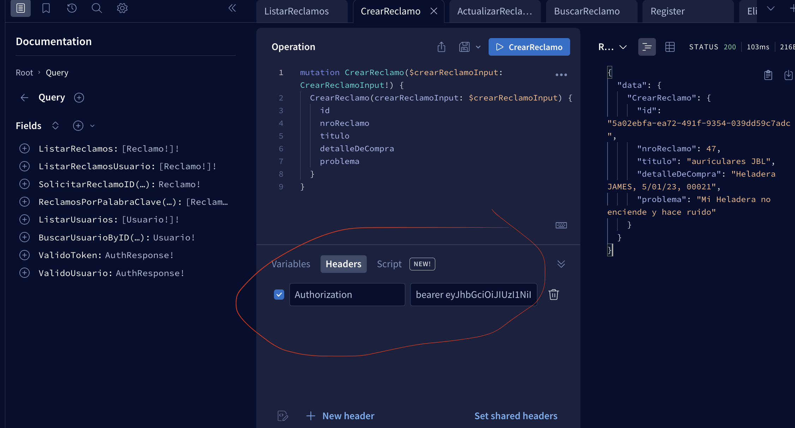

# Proyecto individual entregable
``fecha de entrega:`` 15 de abril

## Tecnologias utilizadas en el proyecto


* ``NestJS``: Framework de NodeJS
* ``GraphQL``: Lenguaje de consulta para APIs
* ``TypeORM``: ORM para NodeJS
* ``PostgreSQL``: Base de datos
* ``Docker``: Contenedores
* ``Docker Compose``: Orquestador de contenedores
* ``AWS``: Servicios de la nube
* ``Terraform``: Automatización de aprovisionamiento

## Letra 


## Desafio Adicional a esto

* Utilizar de alguna manera alguno de los servicios de ``AWS``
* Utilizar de alguna manera la automatización de aprovisionamiento de ``Terraform``

* Hacer testing de la API (última a cosa a investigar personalmente)
* Revisar la parte del bonus. (luego de terminar la parte de aplicar testing)

# Hay dos maneras de correr la aplicación

## ``1. Con Docker:``
se levanta la base de datos y el servidor en un solo comando

## ``2. Con servicio AWS (RDS)``
se levanta el servidor y se conecta a la base de datos en AWS

# INSTRUCCIONES (1) CON DOCKER
## Para poder desplegar en tu maquina local

* Instalar ``NodeJS`` y ``Yarn``
* Instalar ``Docker`` y ``Docker Compose``

* Clonar el repositorio

````
git clone HTTPS_DEL_REPO
````

* Instalar las dependencias

````
yarn install
````

* Crear archivo ``.env`` y copiar el contenido de ``.env-template-postgres-docker``

* Levantar la base de datos
 
````
docker-compose up -d
````
``-d`` para que se ejecute desacoplada de la terminal

* Levantar el servidor
``directorio``: parado en ``/reclamos-app``
````

yarn start:dev
````

# INSTRUCCIONES (2) CON SERVICIO AWS (RDS)

## Para poder desplegar en tu maquina local

* Instalar ``NodeJS`` y ``Yarn``

* Clonar el repositorio

````
git clone HTTPS_DEL_REPO
````
* Instalar las dependencias

````
yarn install
````
* Crear archivo ``.env`` y copiar el contenido de ``.env-template-postgres-aws``


* Levantar el servidor
``directorio``: parado en ``/reclamos-app``
````
yarn start:dev
````

* Abrir el navegador en ``http://localhost:3000/graphql``
* Para ver la documentación de la API, ir a ``http://localhost:3000/graphql``


## Requerimientos

Acciones CRUD para la entidad Reclamo

- obtener todos los reclamos
- obtener un reclamo por id
- actualizar un reclamo por id
- borrar un reclamo por id
- buscar reclamos por palabra clave (descripcion, problematica)
- obtener una lista de reclamos filtrados por palabra clave. (descripcion, problematica)


## Modelo de reclamos

```json
{
  "idReclamo": 1,
  "descripcion": "El producto no funciona",
  "detalleCompra": "fechaCompra, nroFactura, codigoProducto", //Solicitado de 3 inputs distintos
  "problematica": "El producto no funciona",
}
```
# Paso a paso para crear el proyecto

## Instalar NestJS

## Crear proyecto con NestJS

## Instalar graphql en el proyecto, express and apolo

````
yarn add @nestjs/graphql @nestjs/apollo @apollo/server graphql

````

## Tenemos 2 opciones utilizar ``SCHEMA FIRST`` O ``CODE FIRST``
 - [Schema First](https://docs.nestjs.com/graphql/quick-start#schema-first)
  - [Code First](https://docs.nestjs.com/graphql/quick-start#code-first)

  CODE FIRST : es más sencillo de implementar si dominas nest, como es nuestro caso.

  Se podría escribir directamente los tipos con  graphql, pero NestJS nos permite usar Typescript para definir los tipos y que luego se ``traduzcan`` a graphql.

## Todos los servidores que se ejecutan con GraphQL necesitan al menos tener un ``RESOLVER`` que ejecute una ``QUERY`` o ``MUTATION``.

## Crear un resolver

```ts
import { Resolver, Query } from '@nestjs/graphql';

@Resolver()
export class AppResolver {
  @Query(() => String)
  getHello(): string {
    return 'Hello World!';
  }
}
```


## Diferencia entre REST y GraphQL

REST: solicitamos todo el recurso y luego filtramos lo que necesitamos.

GRAPHQL: solicitamos solo lo que necesitamos,  una petición personalizada.


## Validaciones de datos ingresados
para asegurarnos de no guardar datos no deseados en nuestra base de datos vamos a intentar abarcar lo mejor posible las validaciones de datos.

## Instalar class-validator

````
yarn add class-validator class-transformer
````

## Instalar TypeORM

````
yarn add @nestjs/typeorm typeorm
````
## Crear la entidad Reclamo

```ts
@Entity()
export class Reclamo {
  @PrimaryGeneratedColumn()
  idReclamo: number;

  @Column()
  descripcion: string;

  @Column()
  detalleCompra: {
    formatoCSV: string;
    fechaCompra: string;
    nroFactura: string;
    codigoProducto: string;
  };

  @Column()
  problematica: string;
}
```

# Autorización y Autenticación

``Autorización``: es la capacidad de un usuario para acceder a un recurso.

``Autenticación``: es la capacidad de un usuario para identificarse.

Vamos a implementar ambas en la aplicacion de la mano de ``JWT``,

1. Crear una sistema de REGISTRO.

2. Crear un sistema de LOGIN.

### REGLAS DE LA APP
 - Si la persona no esta logueada, solo puede ver los reclamos.

 - Si la persona esta logueada, puede ver los reclamos y crear reclamos.

 - Si la persona es ADMIN, puede ver los reclamos, crear reclamos y borrar reclamos.

Además de la encriptación de contraseñas.

- Cada usuario con su token deberia poder ver sus reclamos. pero no todo de la base de datos.

## Al contar con autorizacion

En las operaciones que se necesitan un usuario con cierta cuenta, en la interfaz de `` apollo `` se necesita que se agregue un header con cierta información.

Como se muestra en la imagen siguiente:



# Autor

* Santiago Neira


